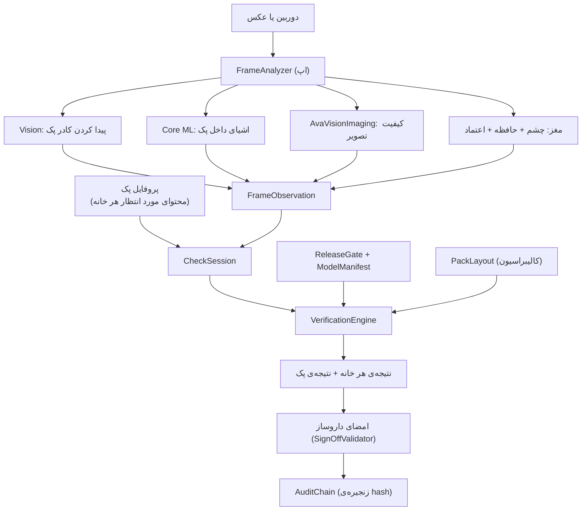

# معماری AvaVision

## جریان داده

## ماژول‌ها

| ماژول | محل | وابستگی | مسئولیت |
|---|---|---|---|
| `AvaVisionCore` | `Sources/AvaVisionCore` | فقط Foundation و swift-crypto | همه‌ی منطق قابل‌تست؛ روی Linux و iOS اجرا می‌شود |
| `AvaVisionImaging` | `Sources/AvaVisionImaging` | Core | محاسبه‌ی وضوح (واریانس Laplacian)، نور و Glare روی تصویر خاکستری |
| `avavision` (CLI) | `Sources/AvaVisionCLI` | Core | hash مدل، گزارش ارزیابی Holdout، بررسی Gate و Audit |
| اپ iOS | `App/AvaVision` | Core، Imaging، SwiftUI، Vision، Core ML، AVFoundation | رابط کاربری، دوربین، اجرای مدل، ذخیره‌سازی |

اصل طراحی: هر تصمیمی که روی ایمنی اثر دارد در `AvaVisionCore` است و تست دارد. اپ فقط داده جمع می‌کند و نتیجه را نشان می‌دهد.

## اجزای هسته

| فایل | کار |
|---|---|
| `Domain/PackLayout.swift` | هندسه‌ی پک (ردیف/ستون، ناحیه‌ی خانه‌ها، نوار مرزی) و تشخیص اینکه یک نقطه در کدام خانه است |
| `Domain/PackProfile.swift` | محتوای مورد انتظار هر خانه و اعتبارسنجی کامل بودن پروفایل |
| `Geometry/Homography.swift` | تبدیل پرسپکتیو از تصویر دوربین به صفحه‌ی صاف پک |
| `Capture/PackRegistration.swift` | قبول یا رد کادر پیدا‌شده (اندازه، زاویه، لبه‌ی تصویر، نسبت ابعاد) |
| `Detection/CompartmentAssigner.swift` | نسبت دادن هر شیء به یک خانه؛ اشیای روی مرز «مبهم» علامت می‌خورند |
| `Decision/VerificationEngine.swift` | مقایسه‌ی مشاهده با انتظار روی چند فریم و تولید نتیجه |
| `Model/ModelManifest.swift` و `ReleaseGate.swift` | هویت و اعتبار مدل و تعیین توانایی مجاز (هیچ / فقط شمارش / شمارش + هویت) |
| `Evaluation/Evaluator.swift` | محاسبه‌ی دقت، False Acceptance و معیارهای هر دارو از روی Holdout |
| `Review/PharmacistSignOff.swift` | قوانین امضای داروساز |
| `Audit/AuditLog.swift` | ثبت زنجیره‌ای و ضد دستکاری هر بررسی |
| `Session/CheckSession.swift` | چرخه‌ی یک بررسی: عکس‌برداری ← تحلیل ← امضا ← رکورد |
| `Brain/*` | مغز یادگیرنده: حافظه، شناسایی open-set، کالیبراسیون، دفتر اعتماد، برنامه‌ی یادگیری ([جزئیات](BRAIN_FA.md)) |
| `Model/EmbedderManifest.swift` | هویت و بررسی سلامت چشم Core ML اختصاصی |

## اجزای اپ مربوط به هوش مصنوعی

| فایل | کار |
|---|---|
| `Services/ObjectDetectors.swift` | مدل تشخیص Core ML، یا segmenter بدون‌آموزش روز اول (Vision + روش کلاسیک) |
| `Services/PillEmbedder.swift` | چشم: Apple feature print یا مدل Core ML اختصاصی |
| `Services/PillCrops.swift` | برش هر قرص و پرسیدن نظر مغز |
| `Services/BrainStore.swift` | ذخیره‌ی مغز و تصاویر تک‌قرص، خروجی برای آموزش |
| `Features/Brain/BrainViews.swift` | داشبورد مغز، آموزش دارو، صف برچسب‌زدن |
| `training/` | آموزش آفلاین چشم اختصاصی (Python) |

جریان یک بررسی: تصویر زنده فقط جای پک و کیفیت را می‌سنجد. وقتی سه عکس خوب جمع شد، روی همان سه عکس قرص‌ها پیدا و از مغز پرسیده می‌شوند، سپس موتور تصمیم اجرا می‌شود. بعد از امضای داروساز، مغز از خانه‌های تأییدشده یاد می‌گیرد.

## مختصات

- تصویر: نرمال‌شده ۰ تا ۱، مبدأ بالا-چپ (Vision مبدأ پایین-چپ دارد و اپ تبدیل می‌کند).
- پک: نرمال‌شده ۰ تا ۱ روی کارت پک، گوشه‌ی بالا-چپ = خانه‌ی اول (مثلاً Day 1 · Morning).
- جهت قرارگیری پک در عکس از تنظیمات اپ (Pack orientation) تعیین می‌شود و روی تصویر زنده با برچسب زرد قابل بررسی است.

## ذخیره‌سازی در اپ

در `Application Support/AvaVision`:

- `catalog.json`، `profiles.json`، `layouts.json`
- `audit/audit-log.jsonl` — هر خط یک `AuditEntry` با hash خودش و hash قبلی

- `brain/brain.json` و `brain/crops/` — حافظه‌ی مغز و تصاویر تک‌قرص (رمزگذاری کامل، بیرون از Backup)

عکس کل پک ذخیره نمی‌شود (ممکن است برچسب پک نام بیمار داشته باشد). فقط SHA-256 پیکسل‌های تحلیل‌شده در Audit می‌ماند.
