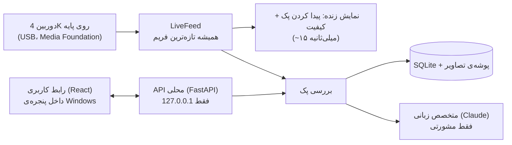
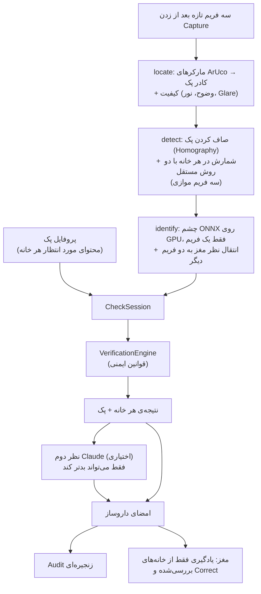

# معماری AvaVision (ایستگاه Windows)

## اجزای ایستگاه

همه‌چیز روی خود کامپیوتر داروخانه اجرا می‌شود. تنها ارتباط بیرونی، درخواست‌های اختیاری به Claude است.

## جریان یک بررسی

## ماژول‌ها

| ماژول | محل | مسئولیت |
|---|---|---|
| هسته‌ی ایمنی | `src/avavision/core` | layout، پروفایل، هندسه، موتور تصمیم، Gate مدل، امضا، Audit، نظر مشورتی. بدون I/O؛ کاملاً تست‌پذیر |
| مغز | `src/avavision/brain` | حافظه، شناسایی open-set، خودآزمایی، دفتر اعتماد، برنامه‌ی یادگیری |
| بینایی | `src/avavision/vision` | دوربین، مارکر و کادر پک، کیفیت، شمارش دوروشی، چشم و مدل تشخیص ONNX، شبیه‌ساز ایستگاه |
| متخصص | `src/avavision/expert` | Claude: خواندن لیست دارو، توضیح، نظر دوم؛ تبدیل قطعی لیست دارو به پیش‌نویس پروفایل |
| ذخیره‌سازی | `src/avavision/storage` | SQLite (WAL، synchronous FULL)، تصاویر قرص و شواهد |
| ایستگاه | `src/avavision/station` | سرویس بررسی، API محلی، دوربین نمایشی، کلید API در Credential Manager |
| رابط | `web/` | React + TypeScript؛ داخل بسته‌ی Python ساخته و سرو می‌شود |
| آموزش | `training/` | fine-tune چشم DINOv2 روی داده‌ی خود داروخانه → ONNX |

اصل طراحی: هر تصمیمی که روی ایمنی اثر دارد در `core` (و قوانین اعتماد مغز) است و تست دارد. ایستگاه، رابط و متخصص فقط مدرک جمع می‌کنند و نتیجه را نشان می‌دهند.

## سرعت

| مرحله | CPU معمولی | با کارت NVIDIA (تخمین) |
|---|---|---|
| پیدا کردن پک (هر فریم زنده) | ~۱۵ ms | همان |
| شمارش ۲۸ خانه × ۳ فریم (موازی) | ~۳۰۰ ms | همان (CPU) |
| چشم DINOv2 برای ~۵۰ قرص | ~۲٫۳ s | ~۳۰–۶۰ ms با TensorRT/CUDA |
| کل بررسی | ~۳ s | **زیر ۰٫۵ s** |

چشم فقط یک‌بار در هر بررسی اجرا می‌شود و نظرش به دو فریم دیگر منتقل می‌شود. ONNX Runtime خودکار سریع‌ترین سخت‌افزار را انتخاب می‌کند: TensorRT ← CUDA ← DirectML ← NPU ← CPU. اندازه‌گیری روی هر کامپیوتر: `avavision benchmark`.

## ذخیره‌سازی

پوشه‌ی داده: `%LOCALAPPDATA%\AvaVision`

| مسیر | محتوا |
|---|---|
| `avavision.sqlite3` | کاتالوگ، Layoutها، پروفایل‌ها، تنظیمات، Audit، حافظه‌ی مغز، صف برچسب‌زنی |
| `images/crops/` | تصویر تک‌قرص‌های حافظه‌ی مغز (برای مهاجرت و آموزش) |
| `images/evidence/` | عکس صاف‌شده‌ی پک برای هر بررسی (قابل خاموش کردن) |
| `models/` | چشم ONNX و Manifest آن (با hash) |

## API محلی

سرور فقط روی `127.0.0.1:8765` گوش می‌دهد. مستندات خودکار: `http://127.0.0.1:8765/docs`.
گروه‌ها: `/api/status`، `/api/camera/*`، `/api/check/*`، `/api/profiles/*`، `/api/catalog/*`، `/api/brain/*`، `/api/audit/*`، `/api/settings`.
