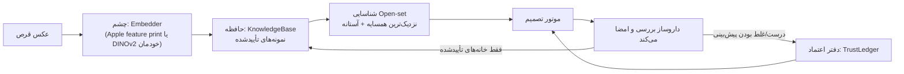

# مغز AvaVision

مغز بخشی از اپ است که **ظاهر هر دارو را یاد می‌گیرد** و با هر بررسیِ تأییدشده‌ی داروساز قوی‌تر می‌شود. کد آن در `Sources/AvaVisionCore/Brain/` است و همه‌ی قوانینش تست دارند.

## ایده‌ی اصلی

روش برتر امروز در شناسایی قرص و در سیستم‌های تجاری (Parata، Omnicell، JVM) یکی است:

1. یک **«چشم» ثابت و قوی** که از هر قرص یک بردار ظاهر (embedding) می‌سازد.
2. یک **«حافظه»** از نمونه‌های تأییدشده که مدام بزرگ‌تر می‌شود.
3. شناسایی با **نزدیک‌ترین نمونه‌ها**، و رد کردن قرصی که شبیه هیچ‌چیز آشنا نیست.

مزیت این روش: داروی جدید **بدون آموزش دوباره‌ی مدل** با چند عکس یاد گرفته می‌شود، و چیزی فراموش نمی‌شود.



## قانون اعتماد نامتقارن (مهم‌ترین قانون ایمنی)

| مغز چه کاری می‌تواند بکند | از کی |
|---|---|
| **هشدار دادن**: «این قرص شبیه داروی X است که اینجا نباید باشد»، «شبیه هیچ داروی شناخته‌شده‌ای نیست» | از روز اول، به‌محض کالیبره شدن |
| **قبول کردن**: شمردن یک دارو با هویت و رساندن خانه به `Verified` | فقط برای دارویی که سابقه‌ی کافی و بی‌خطا ساخته |

هشدار هیچ‌وقت سیستم را ناایمن‌تر نمی‌کند. قبول کردن فقط با مدرک داده می‌شود و با اولین خطا پس گرفته می‌شود.

## اجزا

| جزء | فایل | کار |
|---|---|---|
| Embedding | `Embedding.swift` | بردار نرمال‌شده با شناسه‌ی چشمی که آن را ساخته؛ بردارهای دو چشم مختلف هرگز مقایسه نمی‌شوند |
| حافظه | `KnowledgeBase.swift` | نمونه‌های تأییدشده؛ حداکثر ۴۰۰ نمونه برای هر دارو؛ نمونه‌ی تکراری اضافه نمی‌شود؛ وقتی پر شد، تکراری‌ترین نمونه فراموش می‌شود تا تنوع بماند |
| شناسایی | `IdentityClassifier.swift` | میانگین شباهت به ۵ نمونه‌ی نزدیک هر دارو. خروجی یکی از: «این دارو است»، «مردد بین دو دارو»، «ناشناخته»، «اطلاعات کافی نیست» |
| کالیبراسیون | `IdentityCalibrator.swift` | مغز با خودآزمایی آستانه‌هایش را یاد می‌گیرد (پایین‌تر) |
| دفتر اعتماد | `TrustLedger.swift` | سابقه‌ی هر دارو: درست، غلط، مردد |
| یادگیری | `Learning.swift` | تعیین می‌کند از هر بررسی چه چیزی یاد گرفته شود |
| مغز | `Brain.swift` | همه را کنار هم نگه می‌دارد، ذخیره می‌شود و خلاصه‌اش در Audit ثبت می‌شود |

## کالیبراسیون خودکار

آستانه‌ی «چقدر شبیه باشد تا اسمش را ببریم» به چشم بستگی دارد، پس مغز آن را خودش یاد می‌گیرد:

- هر قرص در حافظه یک بار با **بقیه‌ی عکس‌ها** مقایسه می‌شود (نه با عکس خودش)، و
- یک بار با حافظه‌ای که **کل داروی آن قرص از آن حذف شده** (شبیه‌سازی قرص ناشناخته؛ هر اسمی که بیاورد خطاست).
- آستانه و حاشیه‌ای انتخاب می‌شود که بیشترین پوشش را بدهد و حد پایین دقت (Wilson ۹۵٪) آن دست‌کم ۹۰٪ باشد.
- شرط شروع: دست‌کم ۲ دارو و ۳۰ قرص، هر دارو با ۵ نمونه از ۲ عکس جدا.
- با هر ۲۵٪ رشد حافظه، کالیبراسیون خودکار تکرار می‌شود. اگر آستانه عوض شود، «رکورد پیاپی» همه‌ی داروها صفر می‌شود.

این آستانه فقط برای «اسم بردن» است. قبول کردن نیاز به دفتر اعتماد دارد.

## دفتر اعتماد

فقط از قرص‌هایی ساخته می‌شود که **داروساز شخصاً بررسی کرده**. پیش‌فرض (`TrustPolicy.standard`) برای اعتماد به یک دارو:

| شرط | مقدار |
|---|---|
| تعداد شناسایی بررسی‌شده | حداقل ۱۰۰ |
| حد پایین دقت (Wilson ۹۵٪) | حداقل ۹۷٪ |
| شناسایی درست پشت‌سرهم از آخرین خطا یا تغییر آستانه | حداقل ۵۰ |

- **یک شناسایی غلط ⇐ اعتماد همان لحظه معلق می‌شود** و باید ۵۰ مورد درست پیاپی دوباره ساخته شود.
- پاسخ‌های مردد اعتماد نمی‌سازند و آن را خراب هم نمی‌کنند.
- عملاً یک داروی پرمصرف بعد از حدود ۱۲۵ شناسایی درست بررسی‌شده قابل‌اعتماد می‌شود.

## Spot check (اعتماد کن ولی بسنج)

حتی خانه‌های `Verified` هم به‌طور تصادفی (۱۰٪، و دست‌کم یکی در هر پک) برای بررسی داروساز انتخاب می‌شوند. این انتخاب برای هر نتیجه ثابت و قابل بازسازی است. این‌طوری دقت سیستم همیشه اندازه‌گیری می‌شود و خطای پنهان به دفتر اعتماد می‌رسد.

## مغز از کجا یاد می‌گیرد

| منبع | چطور | چه چیزی یاد می‌گیرد |
|---|---|---|
| **آموزش دارو** (Brain ← Teach a medication) | داروساز ۵ تا ۲۰ قرص یک دارو را روی سطح تیره پخش می‌کند و ۲ عکس یا بیشتر می‌گیرد | نمونه‌ی ظاهر |
| **خانه‌ی تک‌دارویی تأییدشده** | داروساز در امضا خانه را «Correct» زده و تعداد شمرده‌شده با پروفایل یکی است | نمونه‌ی ظاهر + سابقه‌ی اعتماد |
| **خانه‌ی چنددارویی تأییدشده** | به «صف برچسب‌زدن» می‌رود؛ داروساز برای هر قرص دارو را انتخاب می‌کند | نمونه‌ی ظاهر + سابقه‌ی اعتماد |

یاد نمی‌گیرد از: خانه‌هایی که خودکار قبول شده‌اند (مغز نباید خودش را تأیید کند)، خانه‌های «Corrected» یا «Unresolved»، و خانه‌هایی که تعداد شمرده‌شده با پروفایل یکی نیست.

## چشم مغز

| مرحله | چشم | توضیح |
|---|---|---|
| روز اول | **Apple Vision feature print** | داخل iOS، بدون نیاز به آموزش |
| بعد از چند هزار قرص تأییدشده | **DINOv2 تنظیم‌شده روی داده‌ی خودتان** (Apache-2.0) | با `training/` ساخته می‌شود؛ [راهنمای آموزش](TRAINING_GUIDE_FA.md) |

وقتی چشم عوض شود، اپ همه‌ی قرص‌های حافظه را از روی تصاویر ذخیره‌شده دوباره یاد می‌گیرد. آستانه‌ها و اعتماد از صفر ساخته می‌شوند، چون فضای بردارها عوض شده است.

## شمارش روز اول

تا قبل از آموزش مدل تشخیص اختصاصی، اپ برای هر خانه دو روش مستقل را اجرا می‌کند:

- **Apple Vision instance segmentation** (بدون آموزش)
- **روش کلاسیک** بر اساس اختلاف با پس‌زمینه‌ی خانه

اگر هر دو یک تعداد بدهند، قرص‌ها با اطمینان شمرده می‌شوند. اگر اختلاف داشته باشند، خانه «مشکوک» است و به بررسی می‌رود. قرص سفید روی کارت سفید را روش کلاسیک نمی‌بیند. به همین دلیل اختلاف دو روش هرگز با حدس حل نمی‌شود.

## ذخیره و حریم خصوصی

- مغز در `Application Support/AvaVision/brain/` ذخیره می‌شود: `brain.json` و `crops/`.
- تصویرها فقط **یک قرص تنها** هستند، نه کل پک و نه برچسب بیمار. با رمزگذاری کامل iOS ذخیره می‌شوند و از iCloud Backup حذف‌اند.
- خروجی برای آموزش: Brain ← Export training data ← در اپ Files زیر On My iPhone ← AvaVision.

## بررسی مغز بیرون از اپ

```bash
swift run avavision brain-report AvaVision-training-data/brain.json
```

خروجی این دستور کالیبراسیون، تعداد نمونه‌ها و وضعیت اعتماد هر دارو را نشان می‌دهد.
